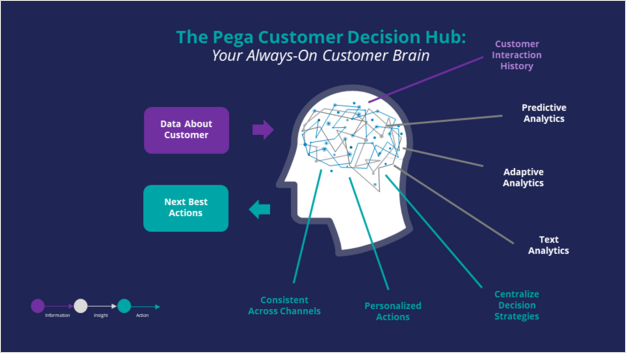
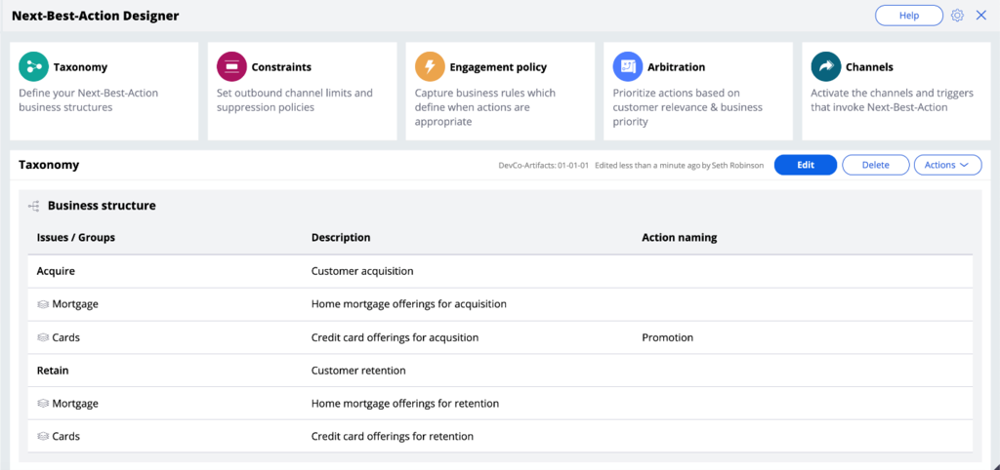
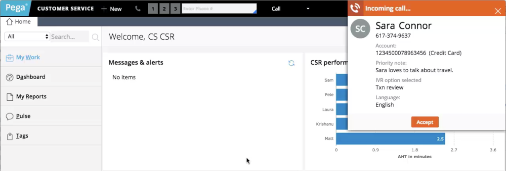
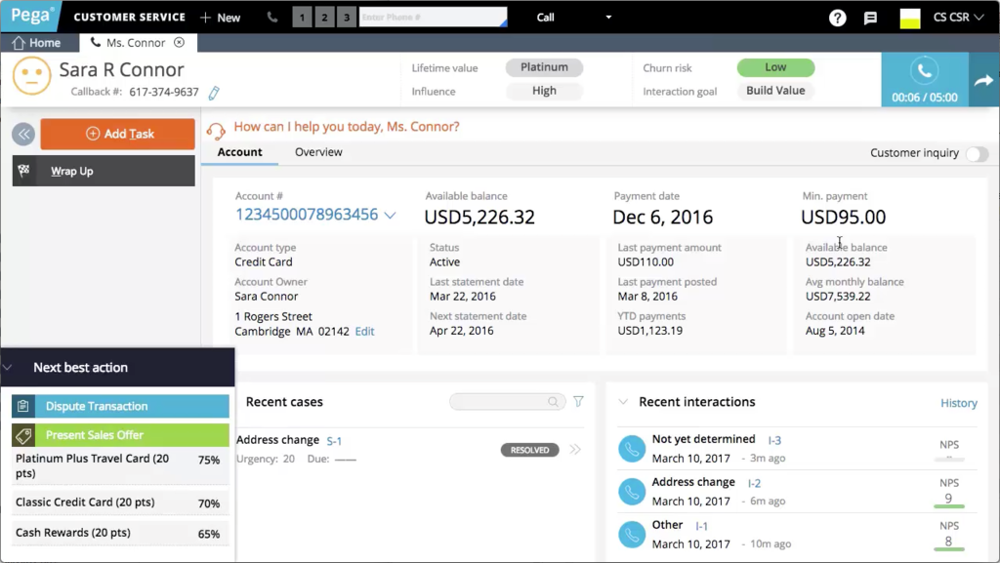

# Pega Decisioning Consultant 8.7

Pega Customer Decision Hub

These notes are paraphrased from the official Pega Academy to help me study for the exam. Some phrasing might be unclear/ambiguous.

[Official Pega Academy Decisioning Consultant Mission (8.7)](https://academy.pega.com/mission/decisioning-consultant/v4)

[Pega Decisioning Consultant Certification Exam (8.7)](https://academy.pega.com/exam/pega-certified-decisioning-consultant-3)

## Table of Contents

1. [Next-Best-Action concepts](#next-best-action-concepts)
1. [Actions and treatments](#actions-and-treatments)
1. [Engagement policies](#engagement-policies)
1. [Contact policy and volume constraints](#contact-policy-and-volume-constraints)
1. [AI and Arbitration](#ai-and-arbitration)
1. [Channels](#channels)
1. [Decision strategies](#decision-strategies)
1. [Business agility for 1:1 customer engagement](#business-agility-for-11-customer-engagement)

## Next-Best-Action concepts

### Main topics

- One-to-one customer engagement
- Optimize the customer value in the contact center
- Essentials of always-on outbound
- Define the starting population

### One-to-one customer engagement

Customers want to buy products, use services, and have a great experience. As a business, you need to take the right action at every "customer touch" so that each conversation or interaction delivers the right message, offer, and level of service.

Pega uses Artificial Intelligence (AI) to drive real-time decisions that deliver user engagement on any channel — Call center, Mobile, Web, etc. Pega calls this their **Omni-channel AI**. When actions are available and consistent in multiple portals, it ensures that the level of service is also consistent.

The AI delivers the right action at every customer touch by using millions of data points in real-time so that the business can make an offer, initiate a retention plan, or predict a problem before it happens. Every decision by the employee or CSR generates the **next-best-action** for the customer and the business.

Pega AI connects to streams like mobile locations or network events to detect patterns and drive the Next Best Action proactively. Any change in **customer context** — a click, reply, location change, etc — will trigger the Next Best Action so that you can listen to the customer and act accordingly.

You can use the **Next-Best-Action** designer to create a next-best-action strategy for your business. There are five main components to a strategy:

1. Taxonomy
1. Constraints
1. Engagement policy
1. Arbitration
1. Channels

<!-- 

- **Taxonomy** - the "business structure" or hierarchy of *Business Issues* and *Groups* to which an action belongs. A **Business Issue** is the purpose behind the action offered to the customer (Retention for keeping customers, Acquisition for gaining customers). A **Business Group** is used to organize customer actions into categories (Under acquisition, groups can be made to organize credit cards with the intent of gaining new customers, something like a *new member credit card*). -->

### Optimize the customer value in the contact center

When a call comes in to the contact center, it gets immediately routed to a service representative, and Next-Best-Action guides the representative through the call with Sara.

In the lower left of the screen, Pega's AI recommends a list of Next-Best-Actions to the agent, so that the service representative can use the "always-on" centralized decisioning "brain" to guide them through the call. 

## Actions and treatments

### Main topics

- Define and manage customer actions
- Present a single offer on the web
- Define an action for outbound

## Engagement policies

## Contact policy and volume constraints

## AI and Arbitration

## Channels

## Decision strategies

## Business agility for 1:1 customer engagement